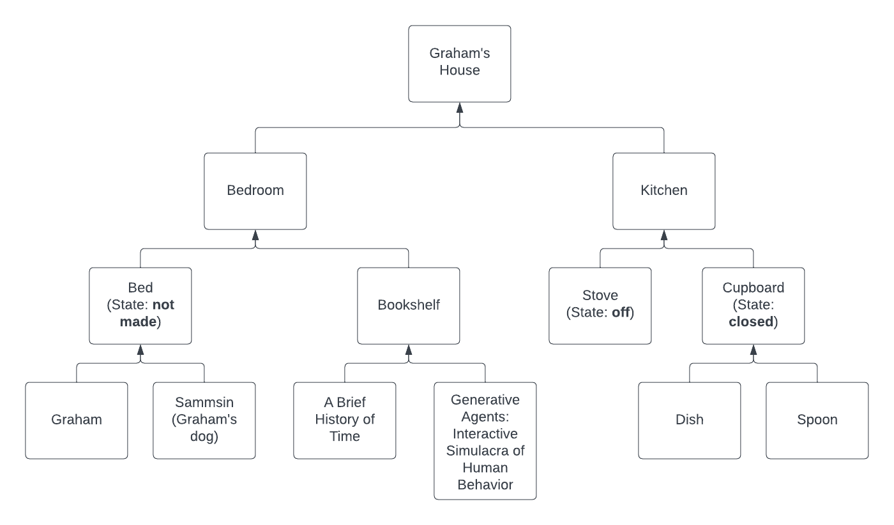

# LLM Ant Farm
## Overview
I will create my own version of the Stanford experiment "Generative Agents: Interactive Simulacra of Human Behavior" in Python and run it with a local LLM such as Alpaca 7B or Dolly 2.0. I will then perform experiments on it to attempt to reproduce the emergent behaviors observed in the Stanford experiment such as information diffusion, collaborative planning & coordination, and more (collective problem-solving, evolution of agent attitudes)

## Goals
- Replicate the Stanford experiment: obtain similar outcomes in terms of information diffusion, agent autonomy, agent ability to reflect & provide accurate information based on knowledge when interviewed.
- Go beyond the Stanford experiment:
    - Introduce adversarial relationships between agents e.g. competition for scarce resources & observe behavior
    - Create a unique LLM instance for each agent trained on that agent's memories & prompt it for agent actions & dialog. (Solve problem of only using some memories for each action/dialog prompt). Retrain each LLM with new memories each night.
    - Give agents goals / problems to solve & resources they can use to solve them.

## Requirements
This program is composed of two top-level component types:

### Agent
- There are as many agents as I decide to create for each experiment.
- Agents have a summary description which comprise the initial entries in their memory stream.
- Agents have a memory stream: A log of their actions, utterances, and observations.
    - Agents have the ability to query their memory stream for memories that are related to any other memory (the "query memory").
    - Memory relatedness is based on 3 factors:
        - Recency: Time delta between memory last access datetime and current datetime
        - Importance: A score indicating the importance of the memory to the agent
            - In the Stanford experiment this score was calculated one time by the LLM - is there a better way e.g. not using LLM & updating score over time?
	- Relevance - cosine similarity between embedding vector of the memory and embedding vector of the query memory
	    - In the Stanford experiment the embedding vectors were created by the LLM - is there a better way?
            - [Yes!](https://www.sbert.net/index.html)
- Agents have a loop routine:
    - Reflect: If the sum of the importance scores of the agent's recent memory exceed a threshold, create a new record in the agent's memory stream by inputting the important memories to the LLM and asking for a higher-level observation.
    - Plan: If the agent has no plan (most recent plan has completed), create a new plan by prompting the LLM with the agent's summary description and a summary of their previous day (user-generated for day o). Add the plan to the agent's memory stream.
         - Plan is composed recursively by first generating high-level (e.g. 5-8 tasks) plan, then recursively breaking down each high-level task into steps and adding them to the plan.
    - React/Update plan: Prompt LLM with agent's most recent observations and plan to decide if plan should be changed, add new plan to agent's memory stream.
    - Generate dialog line (if talking to another agent)
        - Generated by prompting LLM with agent's memories of other agent and conversation history.
    - Action: Execute next step in agent's plan or speak next dialog line.

### World
- There is 1 world.
- The world contains a tree structure which is composed of all the elements of the world, including agents. Parent elements physically contain child elements. Elements may have any number of states and must be in 1 state at any time. If they have no states they are considered to be in a default state at all times.
    - Example Subtree:                
- The world has a loop routine
    - Each iteration performs the following tasks:
        - Run each agent's loop 1 time (ideally run all agents in parallel)
        - Update the world state based on each agent's output behavor for that loop iteration
            - E.g. "Graham goes to the bodega" -> move Graham along path towards bodega at standard agent speed
            - E.g. "Graham reads A Brief History of Time" -> Add ABHoT text (summarized? amount determined by agent reading speed * time step duration?) to Graham's memory
            - E.g. "Graham says 'I am currently reading A Brief History of Time' to Jose" -> Add this phrase to Graham and Jose's memories
            - E.g. "Graham opens the cupboard" -> Update cupboard, set state = open, update agent's memories with cupboard subtree converted to syntax ("the cupboard contains a dish and a spoon)
        - Update each agent's memories with their current perceptions if they have changed
            - E.g. agent has moved to a new location -> convert agent's environment tree to syntax and add to agent memory
            - E.g. environment objects have changed state -> convert object trees & states to syntax and add to agent memory
            - E.g. Another agent has entered an agent's environment -> Parse that part of the environment's tree to syntax and add to agent's memory.
        - Update all agents' memories with the current date and time (incremented from previous world loop)
        
## Notes
### Planned development stack
- LLaMA for LLM 
- Python for agent & world logic
- Redis for world state & agent memory storage
    - Support for embedded vector sorting & similarity scoring
    - Store world state as JSON
- Eventually, PyGame for visual display of world & agent state

### Planned development schedule
1. Write and test Python-based agent and world logic
    1. Test with human-produced responses for agent actions, memory querying, reflections.
1. Add LLM for agent actions, memory querying & reflections
1. Add visual display of world & agent state.
